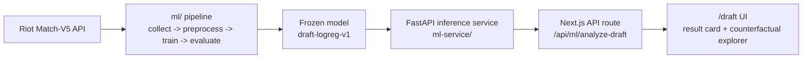

# Scuttle

A full-stack **League of Legends stats tracker** built with Next.js and TypeScript. Search any Riot ID to view ranked progress, champion mastery, recent performance, match history, and detailed lobby statistics across 11 regions.

**Live Demo:** https://lol-stats-tracker-johnf.vercel.app/

---

## Screenshots


---

## Features

### Player Search
- Search players by Riot ID and region
- Supports 11 regions including NA, EUW, EUNE, KR, JP, BR, LAN, LAS, OCE, TR, and RU
- Displays summoner level, profile icon, and account information
- Resolves Riot platform routes to the appropriate regional API endpoints

### Ranked & Champion Data
- View Solo/Duo and Flex ranked information
- Display tier, division, LP, wins, and losses
- View top champion masteries with champion data from Riot Data Dragon

### Match History & Analytics
- Browse recent matches with champion, role, KDA, CS, vision score, damage, items, and game result
- View full match pages with both teams and lobby-wide player statistics
- Calculate recent performance summaries from match data
- Visualize KDA trends across recent games with Recharts
- Handle multikills and non-standard game modes

### Authentication & Search History
- GitHub authentication using NextAuth
- JWT-based user sessions
- MongoDB-backed recent searches for authenticated users
- Automatically deduplicates searches and stores each user's 10 most recent players

### API Reliability & Caching
- Typed Riot API client written in TypeScript
- Handles Riot's platform and regional routing requirements
- Retries requests on rate limits (`429`) and server errors (`5xx`)
- Honors Riot's `Retry-After` response when available
- Uses Upstash Redis to cache frequently requested Riot data
- Match data is cached for **7 days**
- Champion mastery data is cached for **1 hour**
- Fetches match details in small batches to reduce rate-limit pressure

### Draft Intelligence (ML)
- Build a 10-champion draft (5 per side, one per role) and score it against a model trained on 14,826 real ranked matches
- Reports a relative model-score percentile and a qualitative advantage label — deliberately **not** an exact win probability (see [Draft Intelligence](#draft-intelligence) below for why)
- Confidence level and rare-pick warnings shown alongside every result
- **Counterfactual Draft Explorer**: hold nine picks fixed, swap one champion, and compare the model's score against the original draft
- Served by a separate FastAPI inference service (`ml-service/`) behind a frozen, versioned model

---

## Tech Stack

### Frontend
- **Next.js 16**
- **React 19**
- **TypeScript**
- **Tailwind CSS**
- **Framer Motion**
- **Recharts**
- **Lucide React**

### Backend
- **Next.js Route Handlers**
- **Riot Games API**
- **NextAuth**
- **MongoDB / Mongoose**
- **Upstash Redis**

### ML / Draft Intelligence
- **Python** + **FastAPI** (inference service)
- **scikit-learn** (logistic regression model, frozen and versioned)
- **pandas** for the offline data/training pipeline

### Deployment
- **Vercel** (Next.js app)
- **Render** (FastAPI ML service) — see [ML Service Deployment](#ml-service-deployment) under Draft Intelligence

---

## Architecture

Scuttle uses the Next.js App Router for both the frontend and backend.

A player search follows roughly this flow:

```text
Riot ID + Region
       |
       v
Next.js API Routes
       |
       +--> Riot Account API
       |
       +--> Summoner API
       |
       +--> Ranked API
       |
       +--> Champion Mastery API
       |
       +--> Match-V5 API
       |
       v
Normalize + aggregate data
       |
       +--> Redis cache
       |
       +--> MongoDB
       |
       v
Player dashboard + match analytics
```

Riot's API separates endpoints between **platform routes** such as `na1`, `euw1`, and `kr`, and **regional routes** such as `americas`, `europe`, and `asia`. Scuttle maps between the two automatically depending on the endpoint being requested.

---

## API Design

The application exposes internal Next.js API routes that isolate Riot API logic from the frontend:

```text
/api/lol/profile
/api/lol/ranked
/api/lol/mastery
/api/lol/matches
/api/lol/match
/api/recent-searches
/api/auth/*
```

Riot requests are centralized through a typed API client, allowing routing, error handling, retries, and response types to be shared across endpoints.

### Retry Strategy

Requests are retried up to three times when Riot returns:

- `429 Too Many Requests`
- `5xx Server Errors`

If Riot provides a `Retry-After` header, Scuttle waits for the specified duration before retrying. Otherwise, it applies a short incremental delay.

---

## Caching

Scuttle uses **Upstash Redis** to reduce redundant Riot API requests and avoid unnecessary rate-limit usage.

| Data | Cache TTL |
| --- | ---: |
| Match details | 7 days |
| Champion mastery | 1 hour |

Caching is optional during development. If Redis environment variables are not configured, the application continues to fetch directly from Riot.

---

## Database

MongoDB is used for persistent application data.

### Summoner Records

Player profiles are upserted using their platform and PUUID so Scuttle can maintain the latest fetched account information.

### Recent Searches

Authenticated users can access their 10 most recent searches.

Searches are uniquely identified by:

```text
user + platform + Riot name + tag
```

Repeated searches update the existing entry rather than creating duplicates.

---

## Draft Intelligence

**Draft Intelligence** (`/draft`) is a separate ML-powered feature: build a full 10-champion draft and see how it scores against a model trained on real historical ranked matches, then explore how that score changes if one pick were different.

It's a genuinely separate system from the rest of Scuttle — its own data pipeline, its own trained model, and its own small inference service — integrated into the same Next.js app.

### Key features

- **10-slot draft board** with a searchable champion picker and duplicate prevention
- **Model-score percentile + qualitative advantage label** (e.g. "Slight Blue Edge"), not an exact win probability
- **Confidence level** (low / very-low) and plain-language warnings for historically rare champion-role picks
- **Counterfactual Draft Explorer**: hold nine picks fixed, swap one champion, and compare the resulting model-score percentile against the original — every alternative compares against the same original, with its own confidence/warnings
- Fully responsive, with the same loading/error/stale-result conventions as the rest of the app

### Architecture



The Next.js app never talks to the ML service directly from the browser — the client calls `/api/ml/analyze-draft` (a Next.js Route Handler), which calls the FastAPI service server-side via `ML_API_URL`. Same pattern the rest of the app already uses for the Riot API.

### ML methodology

- **Dataset**: 14,826 ranked Solo/Duo matches (queue 420), NA1 platform, Challenger/Grandmaster/Master players only, patches 16.10–16.17
- **Features**: draft-only — the 10 champion-role picks (`blue_top` … `red_support`), one-hot encoded, with rare champion-role combinations (below a `min_frequency=50` threshold) grouped into a shared "infrequent" bucket instead of exploding into hundreds of near-unique sparse columns (541 features total)
- **Model**: logistic regression (`C=0.01`, L2-regularized)
- **Evaluation**: rolling forward-patch validation — trained only on patches strictly before the test patch, repeated across 5 patches — to honestly estimate performance on genuinely unseen future metas, not just a single lucky/unlucky split
- **Model comparison**: a CatBoost model was trained and evaluated head-to-head under the same rolling protocol. It was statistically indistinguishable from logistic regression on log loss, Brier score, and accuracy; its small ROC-AUC edge was driven by a single fold (it lost 3 of 5) and came with a measurably larger train/test performance gap — a sign of overfitting on a feature space this sparse relative to the dataset size. Logistic regression was selected: no less effective, simpler, more interpretable.
- **Also tested, no reliable improvement found**: a bans-inclusive feature set, additional training data, and comparisons across skill-tier populations (Gold through Diamond, collected separately from the apex-tier training set) — see `ml/README.md` and the scripts under `ml/` for the full detail behind each.

Full model config, dataset stats, and evaluation numbers are versioned in [`ml-service/model_registry/draft-logreg-v1.json`](ml-service/model_registry/draft-logreg-v1.json); the day-by-day research narrative lives in [`ml-service/README.md`](ml-service/README.md) and [`ml/README.md`](ml/README.md).

### Important finding

Across every angle tested, **draft-only champion composition showed weak and unstable predictive power** — a mean ROC-AUC around 0.51 across rolling forward-patch folds, barely above chance, and no combination of regularization tuning, model architecture, additional data, or population changes made it reliably stronger.

### Why this matters

That finding directly shaped the product: rather than presenting a precise win probability the data doesn't actually support, Draft Intelligence reports a **relative model-score percentile** against a fixed historical reference population, a qualitative label, and an explicit confidence level — an evidence-based product decision, not a shortfall to hide. The Counterfactual Draft Explorer follows the same discipline: it shows how the *model's own score* moves when one pick changes, always as a percentile-point delta, never framed as a win-probability change or a recommendation.

### Local setup

```bash
cd ml-service
python3 -m venv .venv
source .venv/bin/activate
pip install -r requirements.txt
uvicorn main:app --reload --port 8001
```

Then set `ML_API_URL=http://localhost:8001` in `.env.local` (see [Getting Started](#getting-started)) and run the Next.js app as usual. Full service docs: [`ml-service/README.md`](ml-service/README.md).

### ML Service Deployment

The Next.js app deploys to **Vercel** as usual. The FastAPI ML service needs to be deployed separately — it's a small, stateless Python service with no persistent storage requirement (the frozen model is a ~40KB file committed to git and loaded from disk at startup).

Recommended: **Render** (any host that can run `uvicorn` from a `requirements.txt` works the same way).

1. New Web Service → connect this repo → root directory `ml-service`
2. Build command: `pip install -r requirements.txt`
3. Start command: `uvicorn main:app --host 0.0.0.0 --port $PORT`
4. Once deployed, set `ML_API_URL` on the **Vercel** project (not just locally) to the resulting Render URL

Notes:
- No CORS configuration needed — the Next.js server calls the ML service server-side only, never from the browser.
- Model path resolution is based on the service's own file location (`Path(__file__).parent`), not the process's working directory, so it's safe to deploy regardless of the platform's working-directory conventions.
- Render's free tier spins down on inactivity — if demoing live, hit `GET /health` a minute beforehand to warm it up. `mlFetch` also caps any single request at 10s so a cold/unreachable service fails with a friendly message instead of hanging indefinitely.

### Limitations

- **Reference population**: training data is apex-tier (Challenger/Grandmaster/Master) NA1 only — results may not generalize to other regions or skill tiers (lower-tier cohorts were collected and compared, but never folded into training)
- **Patch drift**: the model is frozen to patches 16.10–16.17 and will drift as champions and the game change
- **Draft-only signal is inherently limited** — see "Important finding" above; this is a relative historical read on a draft, not a strong predictive signal
- **Not a live gameplay recommendation system** — no runes, summoner spells, bans, or in-game state are considered, and the Counterfactual Explorer never suggests a "best" or "optimal" pick, only how the model's own score moves

---

## Getting Started

### 1. Clone the repository

```bash
git clone https://github.com/johnwfan/lol-stats-tracker.git
cd lol-stats-tracker
```

### 2. Install dependencies

```bash
npm install
```

### 3. Configure environment variables

Copy `.env.example` to `.env.local` and fill in real values:

```bash
cp .env.example .env.local
```

```env
RIOT_API_KEY=your_riot_api_key

MONGODB_URI=your_mongodb_connection_string

UPSTASH_REDIS_REST_URL=your_upstash_redis_url
UPSTASH_REDIS_REST_TOKEN=your_upstash_redis_token

ML_API_URL=http://localhost:8001
```

GitHub authentication also requires GitHub OAuth credentials and a NextAuth secret.

For a standard NextAuth v5 setup, these are commonly configured as:

```env
AUTH_SECRET=your_auth_secret
AUTH_GITHUB_ID=your_github_client_id
AUTH_GITHUB_SECRET=your_github_client_secret
```

### 4. Start the ML inference service (for Draft Intelligence)

Draft strength analysis is served by a separate small Python service; see `ml-service/README.md` for full details.

```bash
cd ml-service
python3 -m venv .venv
source .venv/bin/activate
pip install -r requirements.txt
uvicorn main:app --reload --port 8001
```

### 5. Start the development server

```bash
npm run dev
```

Open:

```text
http://localhost:3000
```

---

## Project Structure

```text
src/
├── app/
│   ├── api/
│   │   ├── auth/
│   │   ├── lol/
│   │   │   ├── mastery/
│   │   │   ├── match/
│   │   │   ├── matches/
│   │   │   ├── profile/
│   │   │   └── ranked/
│   │   ├── ml/
│   │   │   └── analyze-draft/
│   │   └── recent-searches/
│   ├── draft/            # Draft Intelligence UI
│   ├── match/
│   ├── settings/
│   └── [platform]/[gameName]/[tagLine]/
│
├── components/
│   ├── draft/            # champion picker, result card, counterfactual explorer
│   ├── home/
│   └── ui/
│
├── lib/
│   ├── cache/
│   ├── ml/
│   │   ├── championNames.ts
│   │   ├── draftCopy.ts
│   │   ├── mlClient.ts
│   │   ├── mlFetch.ts
│   │   └── types.ts
│   └── riot/
│       ├── regions.ts
│       ├── riotClient.ts
│       ├── riotFetch.ts
│       └── types.ts
│
├── models/
└── types/

docs/          # demo script + interview-prep notes for Draft Intelligence
ml/            # research pipeline (data collection, training, evaluation) -- see ml/README.md
ml-service/    # Draft Intelligence inference API -- see ml-service/README.md
```

---

## Riot API

Scuttle uses the official **Riot Games Developer API**.

A Riot API key is required to run the project locally. Development keys expire periodically and may need to be regenerated through the Riot Developer Portal.

Because Riot enforces request rate limits, Scuttle combines Redis caching, batched match fetching, and automatic retry logic to reduce unnecessary requests.

---

## Disclaimer

Scuttle isn't endorsed by Riot Games and doesn't reflect the views or opinions of Riot Games or anyone officially involved in producing or managing League of Legends. League of Legends and Riot Games are trademarks or registered trademarks of Riot Games, Inc.

---

Built by **John Fan**.
